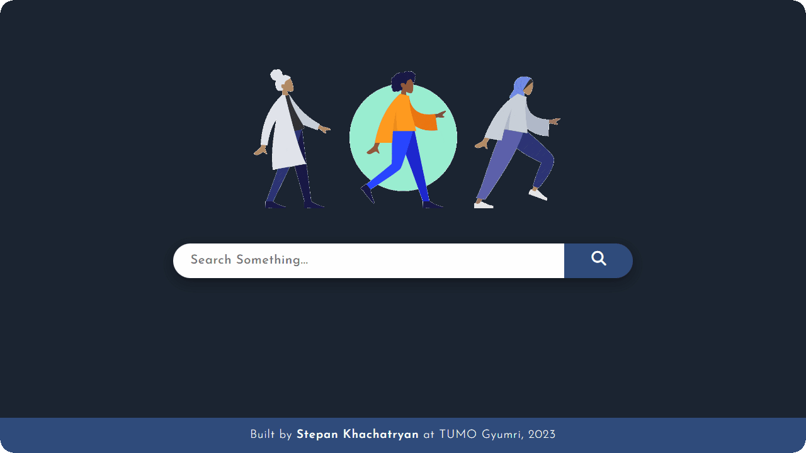

<div align="center">
	<h1>AI Search Engine</h1>
	<h4>#Python #Django #HTML #CSS #JavaScript</h4>
	
</div>

## 🤖 Introduction
This project represents the final work of the "Information Retrieval and Text Analysis" workshop led by Tom Auger at TUMO Center for Creative Technologies.

**Logo Symbolism:**
The project's logo represents that AI (Artificial Intelligence) is for everyone, no matter their age, race, or gender. The figures in the logo show people from different backgrounds walking together towards a future where AI makes lives better.

## 🧐 Overview
The AI Search Engine is a Python Django-powered search website crafted to provide a smooth user experience for retrieving information related to Artificial Intelligence. Imagine it as your friendly search assistant, but specifically for AI - it's like a supercharged Google Search designed to make finding AI information easy and efficient.

### Key Features
- **Efficient Search:** Utilizes a sophisticated algorithm to enhance search accuracy and deliver relevant results.
- **User-Friendly Interface:** Designed with a minimalistic approach for an optimal user experience.
- **Query Enhancements:** Implements spellchecking, case insensitivity, and query simplification to improve search precision.
- **Advanced Query Options:** Supports various query types, including AND, OR, NOT, phrase searches, and proximity searches.

### Query Processing
- **Spellcheck:** Utilizes SymSpell library for accurate spellchecking.
- **Query Simplification:** Preprocessing functions remove unnecessary parts and apply stemming for improved search accuracy.
- **Query Completion:** Implements an algorithm for efficient search suggestions based on unigrams, bigrams, and trigrams.
- **Query Execution:** Handles various search query types for a versatile search experience.

## 🔎 Query Examples
### Simple Search:
	AI applications in healthcare
### Advanced Search:
	"machine learning" AND ("applications" OR "use cases")

## ⚙️ Setup
To view this project locally, follow these steps:
1. **Python Installation:** Ensure that Python is installed on your system. If it's not already installed, you can download it from the [official Python website](https://www.python.org/downloads/). Follow the installation instructions specific to your operating system.\
**Note:** For Windows users, you may need to install Microsoft Visual C++ 14.0 or a later version. You can obtain it through the "Microsoft C++ Build Tools" available [here](https://visualstudio.microsoft.com/visual-cpp-build-tools/).
2. **Repository Cloning:** Clone this repository to your local machine.
3. **Terminal Setup:** Open the terminal (or command prompt for Windows) and navigate to the project directory.
4. **Library Installation:** Install the required libraries by executing the following command:

	```
	pip install -r requirements.txt
	```
5. **Server Launch:** Start the development server using the following command:

	```
	python manage.py runserver
	```
6. **Access the Project:** After starting the development server, open your web browser and navigate to the following local server address to view the project:

	```
	http://127.0.0.1:8000/
	```
If you encounter any issues while running the code, don't worry! Just give a shoutout to ChatGPT, it's got your back with a bunch of digital tricks and a friendly smile. 😊🚀
### ⭐ You can check out the project Live [here](https://stepan928.pythonanywhere.com/).